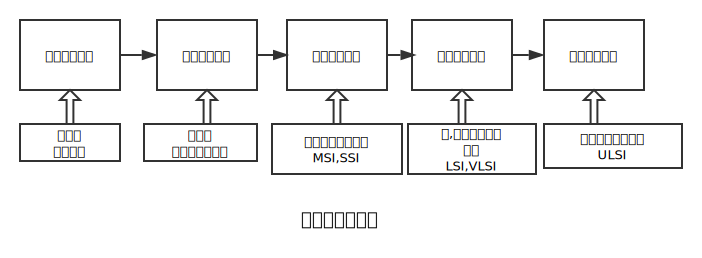
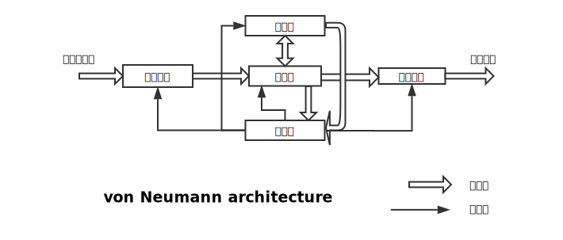
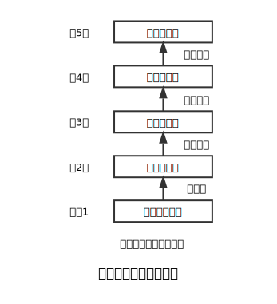

**要求**

- [ ] 了解:
      - 大,中型计算机的典型结构
      - 系列机和软件兼容的含义
      - 计算机系统的多层次结构
      - 实际机器和虚拟机器
- [ ] 理解:
      - 计算机系统的含义
      - 软件和硬件的关系
      - 计算机中主要的性能指标
- [ ] 掌握:
      - CPU和主机两个术语的含义
      - 五大基本部件的功能

---

1.1 计算机历史:

---

1.2 计算机系统组成

计算机系统:计算机硬件(Hardware)和计算机软件(Software)组成.

**cunHardware**:计算机所有的实体部件集合,通常这些不见由电路(电子原件),机械原件等物理部件组成.

**Software**:主要是一些列按照特定顺序组织的计算机数据和指令的集合.

冯·诺依曼(*John von Neumann*)结构 (现代计算机的基本架构):

- 采用二进制形式表示数据和指令.
- 将程序和数据存放在存储器中,使计算机在工作时从存储器去除指令加以执行,自动完成计算任务,这就是存储程序和程序控制(简称存储程序控制)的概念.
- 指令的执行是顺序的,即一般按照指令在存储器中存放的顺序执行,程序分支由转移指令实现.
- 计算机有存储器,运算器,控制器,输入设备,输出设备五大基本部件组成,并规定了五部分的基本功能.

**计算机硬件系统**

- 存储器(Memory):存放数据和程序的部件.
  - 主存储器:直接和运算器,控制器,交换信息.
  - 辅助存储器:作为主存储器后援.外设的形式存在

- 运算器:对信息进行处理.主要是对二进制编码算术(加减乘除)和逻辑(与或非)运算.核心:算术逻辑单元(Arithmetic Logic Unit).
- 控制器:计算机控制核心.读取指令,翻译指令代码,并向计算机各个部分发出控制信号.
- 输入设备:编写的程序和原始数据通过输入设备传输到计算机中.
- 输出设备:将计算机处理结果以人或其他机器能接受的方式送出.

**中央处理单元**(*Central Processing Unit,CPU*):运算器和控制器是信息处理的中心部件.

**主机**:存储器,运算器,控制器,在信息处理中起到主要作用,是计算机硬件的主体部分.

外部设备:输入(Input)设备和输出(Output)设备,简称I/O设备

**计算机软件系统**

计算机软件:能使计算机工作的程序和程序运行时需要的数据,以及与程序数据相关的文字图表等文档资料.

- 系统软件:管理,监控和维护计算机资源(包括硬件和软件)的软件.为计算机基本使用提供支持.
- 应用软件:对于不同领域提供特定服务.

常见的系统软件有操作系统,语言处理程序,数据库管理系统,服务程序.

**硬件和软件的逻辑等价性**

现代计算机是一个十分复杂的由软件,硬件结合而成的整体,软件硬件相辅相成.

**计算机系统的层次结构**

系列计算机(系列机):每个机型都有相同的基本指令系统,相同额数据结构,相同的基本输入输出操作,支持相同的基本系统软件.

系列机是为保证软件兼容性.

软件兼容是指软件不经修改就能在不同机型上正确运行.

- 软件的向上兼容性-原档机开发软件可无差别的在高档机上使用.
- 软件的向下兼容性-原档机开发软件可无差别在高档机上使用.

兼容(Compatible):利于生产的系列产品(广义)推广.

---

1.3计算机的特点和性能指标

**计算机工作的特点**

运算速度快,计算精度高,存储容量大,具有逻辑判断功能,自动化程度高,通用性强.

**计算机的性能指标**

- 主频,运行速度

- 字长,运算精度,指令字长度,存储单元长度

- 运算速度,等效速度各种指令平均运行时间以及对应的指令运行比例计算而来.

- 存储容量,

- 可靠性,平均无故障时间衡量

- 可维护性,处理故障的时间

- 可用性,使用效率

- 兼容性,广义的设备和程序可以用于多种系统的性能.

  ​