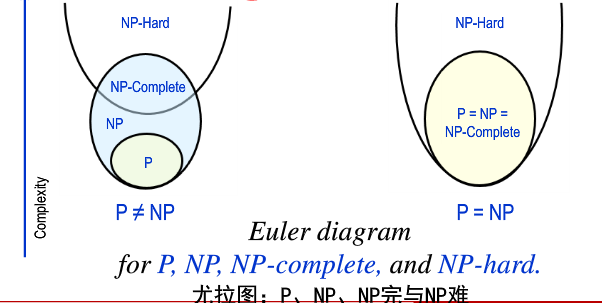

计算复杂性理论中的一个重要概念，它表征某些问题的固有复杂度。

例子:

巡回销售员问题也称货郎担问题，是一个著名的NP完全问题。
假定有一个销售员要到n个城镇去推销产品,已知各城镇间的距离和一个界限B。
问是否有一条旅行路线，恰好通过每个城镇一次，最后回到出发点，且使旅行路线的总长不超过B。
巡回销售员问题实际是**一类问题**。当对城镇数、城镇间距离和界限 B**给定具体数值**后，就能得到**其中一个具体问题**，有时也称作巡回销售员**问题的一个“实例”**。**算法是针对**巡回销售员**这类问题**而言的，即**对其中任何实例**都应是行之**有效**的。

---

### P类问题、NP类问题、NPC类问题

Left side is valid under the assumption P ≠ NP.

Right side is valid under the assumption P = NP.

---

**P类问题**：所有可以在<u>多项式时间</u>\*内求解的<u>判定问题</u>**构成P类问题。

P:Polynomial time ~多项式时间~

*多项式时间(Polynomial time.)：在计算复杂度理论中，指的是一个问题的计算时间**m(n)(一阶多项式)**不大于问题大小n的**多项式倍数**。

**判定问题：判断是否有一种能够解决某一类问题的能行算法的研究课题。

---

 **NP类问题**：所有的<u>不确定性</u>*多项式时间可解的判定问题构成NP类问题。

NP: Non-deterministic Polynomial time ~不确定性多项式时间~

*不确定性算法：不确定性算法将问题分解成<u>猜测和验证</u>\*\*两个阶段。

**算法的猜测阶段是非确定性的，算法的验证阶段是确定性的，它验证猜测阶段给出解的正确性。

设算法A是解一个判定问题Q的非确定性算法，如果A的验证阶段能在多项式时间内完成，则称A是一个多项式时间非确定性算法。

有些计算问题是确定性的，比如加减乘除之类，你只要按照公式推导，按部就班一步步来，就可以得到结果。

有些问题无法直接地计算出来。比如，大的合数分解质因数的问题，有没有一个公式，把合数代进去，就直接可以算出，它的因子各自是多少？

这种问题的答案，是无法直接计算得到的，只能通过间接的“猜算”来得到结果。

这也就是不确定性问题。

这些问题的通常有个算法，它不能直接告诉你答案是什么，但可以告诉你，某个可能的结果是正确的答案还是错误的。这个可以告诉你“猜算”的答案正确与否的算法.

多项式非确定性问题,可以在多项式（polynomial）时间内算出来的问题.

---

**NPC问题**:NP中的某些问题的复杂性与整个类的复杂性相关联.

NP-Complete: both in NP and NP-hard ~NP与NP难的交集~

这些问题中任何一个如果存在多项式时间的算法,那么所有NP问题都是多项式时间可解的.

这些问题被称为NP-完全问题(NPC问题)。

---
## 应用
算法设计和分析过程中,如果已证明某问题是NP完全的,这就意味着面临的是一个难于处理的问题。对于它，要找出一个在计算机上可行的（即多项式时间的）算法是十分困难的,甚至可能根本找不到.

因此，对于NP完全问题，最好是去寻找近似解法，或者针对该问题的某些有实用价值的特殊情况，寻找多项式时间算法。

---

## 总结

P类问题是可以在多项式时间内解决的，polynomial problem。
NP类问题，可以在多项式的时间里任意验证一个解的问题，non deterministic polynomial
NPC问题，最不可能转换为p决定的问题的集合，np complete